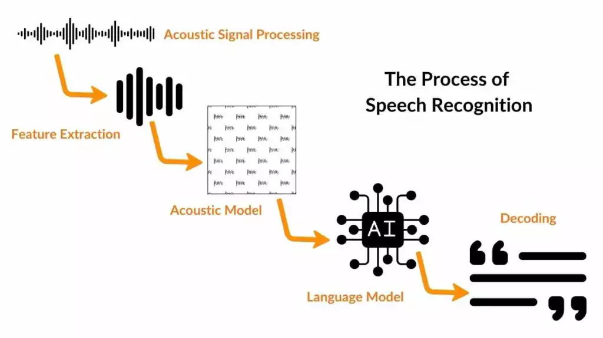

# S2TP Automatic Speech Recognition (ASR) Project

## Introduction

Automatic Speech Recognition (ASR) is a critical field of deep learning that powers many speech-to-text applications, such as captioning tools and transcription services. It is essential for a wide range of use cases, including accessibility tools for the deaf and hard-of-hearing community, as well as for services like customer service call transcripts, audio summaries, and more.

### ASR's Impact on the Deaf Community
ASR is especially important for individuals who rely on captioning as a means of communication. As someone who grew up with a deaf father, I have personally witnessed the importance of these tools. Over the years, I’ve seen captioning tools, like Ava, Otter.ai, and Google Captions, evolve, offering higher-quality transcriptions and benefiting from continuous improvements in ASR technology.

### Project Motivation
The motivation for this project stemmed from my personal experiences with captioning tools and the advancements I've observed in ASR technology. The goal of this project was to explore the deep learning techniques driving ASR systems, evaluate how well my own model performs, and compare it against a pretrained ASR model to better understand their effectiveness in real-world scenarios.

## Data Description

#### LibriSpeech ASR Dataset
The LibriSpeech dataset is a widely used collection in the field of Automatic Speech Recognition (ASR). It consists of up to 1000 hours of spoken word audio from audiobooks, which is provided by OpenSLR and can be downloaded from Hugging Face (HF). The dataset is segmented into approximately 5-second audio chunks for training and evaluation purposes.

### Dataset Details
* Train Split: 2162 samples
* Validation Split: 270 samples
* Test Split: 271 samples
**Each example in the dataset contains:**

* .flac file: The raw audio source.
* Audio Array: A vectorized form of the raw audio (e.g., similar to what is plotted in the mel-spectrogram).
* Speaker ID: Identifies the speaker in the audio sample.
* Chapter ID: The chapter identifier from the audiobook.
* Metadata: Includes details about audio quality and the sampling rate.
For this project, I manually created subsets of the validation split to tailor the data for training and evaluation.

## Features

* data_utility.py: download and store librosa asr dataset from hugging face to librosa_cache directory
* model.py: train and evaluate my simpleCTCmodel and Wav2Vec from meta
* notebook.ipynb: cells to organize and run project code 

## Usage 

#### Model.py
**Args**
* --mymodel: run training and evaluation code for simpleCTC Model, model weights saved to evaluation dir
* --wav2vec: evaluate training data with wav2vec model (meta)
* adding both args will compare the two models
* adding --eval will only evaluate simpleCTC model and save evaluation plots to evaluation dir
  * if there are no model weights saved user will be prompted to train the model
 
*please note... my model is currently suffering from vaninishing/exploding gradients resulting in nan loss*

*--eval will evaluate based on saved (nonsensical weights) code may not work as expected*

#### data_utility.py
**Args** 

 * --talapas: save librispeech validation split to librispeech_cache dir 
 
 * --display: display transcription, raw wavefom, mel spectogram and playable audio
## Discussion
#### Model Performance and Challenges
My model did not perform as expected, and this outcome is not entirely surprising. High-quality Automatic Speech Recognition (ASR) is a highly ambitious project. The performance of my model falls short in comparison to state-of-the-art models. This experiment has given me valuable insight into the complexities of ASR tasks and what goes into developing high-performance systems.

ASR requires extremely precise data preparation—much more than just handling audio length, sampling rate, and transcription. Even for a simple model like mine, these foundational factors need careful attention. However, to compete with state-of-the-art ASR models, one typically needs either massive amounts of computationally expensive raw audio processed through transformers or multi-modal systems, such as those used in leading ASR models like Wav2Vec2 or DeepSpeech.

#### Limitations of My Current Model
Currently, my model faces a critical issue: NaN loss during training, which prevents it from effectively evaluating the data. There are a few factors that could contribute to this problem, including:

* Exploding Gradients: The model architecture may have issues with gradient magnitudes during backpropagation. Although I tried using gradient clipping, it’s possible that my model's complexity and structure require additional adjustments.

* Improper Data Preprocessing: The model may not have been trained on a sufficiently diverse range of features. Features such as background noise, speaker variances, or audio distortions might not have been well-represented in the training data, leading to poor generalization and model instability.

* CTC Loss Function: The use of CTC Loss in the model might not be ideal for the current architecture. Other loss functions or more sophisticated approaches may be needed for better stability.

#### Future Directions
Despite the current setbacks, I see this project as a learning experience and a stepping stone towards improving ASR systems. I plan to continue developing and refining this model. Specifically, I aim to address the following:

* Enhance Data Preprocessing: It's clear that the data preparation process for ASR tasks needs to be more robust. In the future, I will ensure that all relevant features are captured, such as audio pitch, speaker characteristics, noise, and other environmental factors that could improve the model’s robustness and accuracy.

* Reevaluate Model Requirements: I will reconsider the requirements for building and training a model, especially in relation to the scale of audio data. Instead of padding audio to the maximum length, I’ll experiment with subset audio chunks that retain key information. I also plan to investigate alternative transformers or sequence models that might perform better for ASR tasks. For example, besides Wav2Vec2, I will explore models like Conformer and DeepSpeech to see how they might fit into my architecture.

* Explore Pre-built Models: Given the challenges encountered, I will explore leveraging pre-built ASR models as a baseline for developing real-world speech-to-text tools such as captioning software. These models have already been trained on large-scale datasets and can provide a better starting point, potentially offering better results in less time.

## Conclusion:
Although my model currently cannot evaluate properly due to training issues, this project has sparked a deeper interest in the complexities of ASR. Moving forward, I will focus on improving data preprocessing, revising the model’s architecture, and leveraging powerful pre-trained models to continue exploring the ASR field. ASR is an evolving space with many challenges, but with continued research and refinement, I hope to contribute to this rapidly developing technology.

